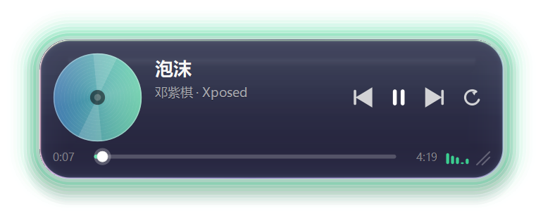

# 音璃 MusicGlass

> 一个常驻桌面的**液态玻璃音乐小组件**：无边框、透明、圆角，四周一圈薄荷绿氛围光；
> 与 QQ音乐互通，实时显示歌名 / 歌手 / 封面 / 进度，并提供播放控制。



**功能速览**

- **液态玻璃**：真折射（pyglass 放大镜抓屏 + 折射着色器），不是半透明贴图；鼠标进出还有平滑的透明度过渡
- **QQ音乐联动**：走 Windows SMTC，歌名 / 歌手 / 专辑 / 封面 / 进度 / 播放状态都能读，播放暂停、上下首、循环模式都能点
- **动画**：封面旋转、频谱跳动、氛围光呼吸、切歌淡出淡入，全部挂在**一个共享的 30fps 时钟**上（暂停即冻结，静态时 CPU 接近 0）
- **系统托盘**：左键显示/隐藏、中键播放暂停、右键菜单；托盘提示里一直能看到在放什么歌
- **开机自启**：托盘菜单一键开关（写 HKCU 的 Run 键，不需要管理员权限）
- **贴桌面**：贴在桌面上、被普通窗口盖住（而不是永远浮在最上层）；可拖动、可滚轮缩放、可拖右下角手柄缩放
- **省电设计**：只重绘需要重绘的那一小块；抓屏跟着"用户有没有在操作"自动调速；被盖住就停抓屏

> 个人自用项目，MIT 协议完全开源。Windows 10/11 · Python 3.10+ · PyQt6

布局示意：

```
┌──────────────────────────────────────────────────────┐
│  ╭────────╮   泡沫                    ⏮  ⏸  ⏭  ⟳   │
│  │  唱片  │   邓紫棋 · Xposed                          │
│  ╰────────╯   0:12  ──────●────────  4:19  ▂▄▆▃▅      │
└──────────────────────────────────────────────────────┘
```

---

## 快速开始（普通用户）

1. 打开 [Releases](https://github.com/yumiko-sleep/MusicGlass/releases) 页面，下载最新的 **`MusicGlass-v0.5.0.zip`**
2. 解压到任意目录（建议放固定位置，比如 `D:\MusicGlass`）
3. 双击解压出来的 `MusicGlass\MusicGlass.exe` 就能跑（首次启动自动放到屏幕右下角）

- **开机自启**：右键托盘图标 → 勾选「开机自启」
- **退出**：右键托盘图标 → 「退出音璃」（右键组件也有「退出音璃」）
- **杀软拦截**：发布的是**文件夹版**（不是单文件自解压，避免杀软启发式误报）。万一还是被拦，把整个目录加白名单即可。

## 系统要求

| 项目 | 要求 |
|---|---|
| 系统 | Windows 10 / 11（64 位） |
| 播放器 | QQ音乐 PC 版（走系统 SMTC 读取；其它播放器理论可用但未实测） |
| 运行库 | 免安装包已自带 Python 与 Qt，**不需要**预先装 Python |
| 源码运行 | Python 3.10+（见下方「依赖说明」） |

## 快捷键与操作

**托盘图标**

| 操作 | 效果 |
|---|---|
| 左键单击 | 显示 / 隐藏组件 |
| 中键单击 | 播放 / 暂停 |
| 右键单击 | 菜单：隐藏组件 / 只贴桌面 / 置顶显示 / 开机自启 / 动画效果 / 回到屏幕右下角 / 关于 / 退出音璃 |
| 鼠标悬停 | 提示条里显示当前歌名与歌手 |

**组件上**

| 操作 | 效果 |
|---|---|
| 鼠标移入 / 移出 | 不透明度 62% ⇄ 100% 平滑过渡 |
| 按住面板空白处拖动 | 移动组件位置 |
| 拖右下角斜线手柄 / 滚轮 | 等比缩放（滚轮每格 5%） |
| 点 ⏮ / ⏸ / ⏭ / ⟳ | 上一首 / 播放暂停 / 下一首 / 循环模式 |
| 拖进度条 | 跳到指定位置（QQ音乐不支持，会弹提示而不是假装能拖） |
| 右键点击组件 | 菜单（内容同托盘菜单的主要项） |

**键盘**（仅「置顶」或「不贴桌面」模式下有效 —— 贴桌面模式刻意不让窗口抢焦点，快捷键会失效，请改用右键菜单）

| 键 | 效果 |
|---|---|
| `Esc` | 隐藏到托盘（没开托盘时＝退出） |
| `空格` | 播放 / 暂停 |
| `←` / `→` | 快退 / 快进 5 秒 |
| `↑` / `↓` | 放大 / 缩小 |

## 依赖说明

运行源码需要（见 [requirements.txt](requirements.txt)）：

| 依赖 | 用途 |
|---|---|
| `PyQt6` | 窗口、绘制、托盘 |
| `pyglass-qt` | 液态玻璃的真折射（放大镜抓屏 + 折射着色器） |
| `numpy` | 封面缩放与位图处理 |
| `winrt-runtime` / `winrt-Windows.Media.Control` / `winrt-Windows.Storage.Streams` / `winrt-Windows.Foundation` | 读 Windows SMTC（QQ音乐的歌名 / 封面 / 进度 / 控制） |
| `Pillow` | 封面解码与圆形遮罩烘焙 |

开发 / 打包额外需要（见 [requirements-dev.txt](requirements-dev.txt)）：`pytest` 与 `PyInstaller`。

---

> 以下为**开发过程记录**（阶段进度、性能实测数据、踩过的坑与结论）。只想用的人到这儿就够了。

## 一、当前进度

| 阶段 | 内容 | 状态 |
|---|---|---|
| 0.5 | pyglass 折射冒烟测试（本机可行性 + 性能摸底） | ✅ 完成 |
| **1** | **玻璃窗口骨架：透明无边框 / 圆角 / 拖动 / 缩放 / 鼠标进出透明度 / 假数据** | ✅ **完成** |
| 2 | 接入 SMTC 读取 QQ音乐（歌名/歌手/封面/进度） | ✅ 完成 |
| 3 | 媒体控制 + 托盘 + 长时间运行稳定性 | ✅ 完成 |
| 4 | 动画（旋转封面、频谱条、氛围光呼吸、切歌过渡） | ✅ 完成 |
| 5 | PyInstaller 打包单文件 exe（开机自启与托盘已在阶段3 完成） | ✅ 完成 |

阶段 1 已经实现的能力：

* 无边框、透明、圆角玻璃面板，真折射（边缘会弯、有色散）
* **窗口只贴在桌面上**：不会被其它程序看到它挡在面前，Win+D / 显示桌面 时它还在
* 鼠标移入变不透明 / 移出变半透明（平滑过渡）
* 任意位置按住拖动；右下角拖拽或滚轮等比缩放（55% ~ 220%）
* 位置与缩放自动记住（`%APPDATA%\MusicGlass\config.json`）
* 左侧圆形封面 + 歌名/歌手 + 进度条 + 时间 + 四个控制按钮 + 装饰频谱条
* 假数据源：4 首歌自动播放、进度真实走动、**按钮真的能用**（上/下一首、播放暂停、循环模式）
* 右键菜单：切换置顶 / 贴桌面、回到右下角、退出

### 阶段 2 已完成的能力

* **真实读取 QQ音乐**：歌名、歌手、专辑、封面、总时长、播放进度、播放/暂停状态
* 封面用代码做的圆形遮罩位图 + LRU 缓存（不会每帧重新缩放，听一小时也不会涨内存）
* 进度条**本地插值平滑走动**（200ms 刷新），每 500ms 用 QQ音乐上报的真实进度校准一次
* 换歌自动刷新（靠“歌名+歌手+专辑”判断，不会每轮都当成换歌）
* 没开 QQ音乐 时显示“未检测到 QQ音乐”，而不是默默留着上一首歌
* 不支持的操作**明确提示**（组件下方弹一条提示），不假装成功 —— 详见下面“SMTC 实测能力”

### 阶段 3 已完成：系统托盘

托盘是贴桌面模式下的“总入口”（那种模式刻意不拿键盘焦点，所以快捷键用不了）：

| 操作 | 效果 |
|---|---|
| 左键单击托盘图标 | 显示 / 隐藏组件 |
| 中键单击 | 播放 / 暂停 |
| 右键 | 打开菜单 |
| 鼠标悬停 | 提示文字里直接显示当前在放的歌 |

菜单项目：隐藏/显示组件 · 只贴桌面 · 置顶显示 · 开机自启 · 动画效果 · 回到屏幕右下角 · 关于 · 退出

行为上的三个改变：
* **关闭窗口（或按 ESC）= 隐藏到托盘**，不再直接退出。否则用户按一下 ESC 组件就没了，还得重新启动；
* 真正退出走托盘的“退出音璃”，退出时会按顺序停掉工作线程、释放放大镜/抓屏资源，不留幽灵图标；
* 隐藏后抓屏会停（基本不占 CPU），但 SMTC 轮询继续（每 500ms 三次 COM 调用，可忽略），
  所以托盘提示里一直能看到在放什么歌。

### 阶段 3 已完成：长时间运行稳定性

目标：开着不管它，几小时后回来还得是好的。具体做了五件事：

| 场景 | 行为 |
|---|---|
| 开机时 SMTC 服务/播放器还没就绪 | **不再永久放弃**：退避重试（1s → 10s 封顶），拿到就继续 |
| 工作线程内部抛异常 | **监督循环**：退 2 秒重建事件循环重来，单个异常掀不翻读取线程 |
| 整个读取线程死了 | **看门狗**：每 2 秒检查，连续两次没活就重启线程并记日志 |
| 换歌瞬间读不到东西 | **瞬断容忍**：连续 3 次（1.5 秒）失败才判为断开，否则切歌时界面会一直闪 |
| QQ音乐 关掉再打开 | 关掉 → 显示“未检测到 QQ音乐”；重新打开 → 自动接上新会话，并弹一条“已重新连接播放器” |
| 播放器重启后点按钮 | 失效的会话对象会被丢掉、重新挑一个再试一次（不用重启组件） |

两个资源细节：
* 每次取封面后**显式关闭数据流**（不关会漏 Win32 句柄，挂机几小时看得很明显）；
* 退出时按顺序显式收尾（停工作线程 → 释放抓屏 → 收 UI），不再出现退出时崩溃。

怎么自己测：`tools/soak_test.py`（见下面“开发与调试”）。

### 阶段 4 第 1 步已完成：性能优化（43% → 4~5% 单核）

先量化再优化（`--perf` 打开性能计数器），量出来两个反直觉的事实：

1. **屏幕抓取的耗时与面积无关**。原生 BitBlt 实测：32x32 要 22ms，978x492 也是 23.5ms
   —— 有个 ~21ms 的固定延迟。所以“抓小一点省 CPU”是错的，**只能少抓**；
   而且抓得太小反而让 pyglass 的变化检测变敏感（折射次数 11 → 25）。
2. **“局部重绘”原本根本没省钱**。Qt 只把**输出**裁到更新区域，
   而我的绘制代码照样会跑（路径构造/裁剪/抗锯齿的开销照付）——
   实测进度条每 200ms 刷一次，每次都白跑了整 2.16ms 的全套绘制。

于是做了四件事：

| 优化 | 做法 | 效果 |
|---|---|---|
| 抓屏节流跟人走 | 悬停中 / 3 秒内有输入 → 250ms；用户静静的时候 → 3000ms | 30% → 1.5~3% |
| 折射走 fast 路径 | 跳过霜化散射（`refract_fast`，默认霜化只有 0.15，观感差别很小） | 39ms → 31ms |
| 按区域跳过部件 | 先算“这次要画的区域和谁相交”，不相交就整块跳过 | 局部重绘 2.16ms → 1.1ms |
| 背景变化只重画面板 | 面板外的阴影/氛围光是静态的，不跟着重画 | 整块重绘 → 0 |

关键实现点：`platform/winutil.system_idle_seconds()`（用 `GetLastInputInfo`，
几乎零成本又很准的信号）+ `GlassWindow._update_cadence()` + `_dirty_parts()`。

优化前后（`--on-top` 一直可见模式，4 核机器，面板已放大到 566x170）：

| 项目 | 优化前 | 优化后 |
|---|---|---|
| 放大镜抓屏 | 5 次/秒 × 59ms = 30% | 0.3 次/秒 × 70ms = 1.5~3% |
| 折射 | 2 次/秒 × 39ms = 18% | 0.3 次/秒 × 32ms = 0.6~1.3% |
| 整块重绘 | 14 次/5s × 5.4ms = 1.5% | 0（启动后不再发生） |
| 局部重绘 | 5 次/秒 × 2.16ms | 5 次/秒 × 1.1ms |
| **合计** | **≈43% 单核（10.8% 整机）** | **≈4~5% 单核（≈1% 整机）** |

默认（贴桌面）模式仍然是 ~0.2%，因为它被别的窗口盖住时会直接停掉抓屏和重绘。

### 阶段 4 第 2 步已完成：动画（一个共享的 30fps 时钟）

四个动画：封面旋转（18°/秒，一圈 20 秒）、频谱条跳动、氛围光呼吸（周期 4 秒）、
切歌过渡（淡出 → 换内容 → 淡入）。

**为什么是“一个时钟”而不是每个部件一个定时器**（实现：`ui/animation.py`）：

* 4 个部件各开一个 30fps 定时器 = 每秒 120 次唤醒，而且互不对齐，
  一帧里会变成 4 次独立重绘请求；共享时钟一个 tick 把所有动画一起推进，
  重绘请求还能被 Qt 合并成同一帧；
* 更关键的是**一致性**：暂停/隐藏/被遮住时只把时钟停掉，不会出现
  “某个部件忘了停、悄悄烧 CPU”。

**什么时候停**（省 CPU 的真正手段）：

| 情况 | 行为 |
|---|---|
| 播放中 | 封面转 + 频谱跳 + 氛围光呼吸 |
| 暂停 | 三个一起停，画面**冻结在当前位置**（不重置，所以不会“跳”一下） |
| 窗口隐藏 / 被别的窗口盖住 | 时钟整个停掉（不是空转）；被盖住时看的是"**组件本身**还露不露着"（面板上取三个点探测），而不是只看前台窗口 |
| 菜单里关掉“动画效果” / `--no-anim` | 回到阶段3 的静态样子，时钟一帧不跑 |

**切歌过渡怎么做的**：状态机 + 共享时钟推进（不是 `QTimer.singleShot`，那样快连点“下一首”
会错拍）。淡出 0.15s → 在透明度为 0 时换内容 → 淡入 0.28s。
过渡期间 UI 画的是**旧** Track，所以永远不会看到“半新半旧”。

**动画的 CPU 开销**（实测，4 核机器，数据源用假数据保证条件一致）：

| 项目 | 数值 |
|---|---|
| 每帧重绘（封面+频谱+玻璃，自检工具里的测量） | 1.58ms → **0.82ms**（下面是三处优化） |
| **默认贴桌面模式**（组件被其它窗口盖住） | 无动画 1.79% → 有动画 **1.75%**（动画已挂起，等于不花钱） |
| `--on-top` 一直可见 | 无动画 0.46% → 有动画 **5~6% 单核**；改 `--fps 15` 降到 4.4% |
| 其中"我们自己画"的部分 | 约 2.5%，其余是 Qt 把**整个半透明窗口**重新上传（跟画多少无关，只跟帧率有关） |

最后一行很关键：因为是半透明窗口，"每帧重绘"这件事本身就要把整张
512x232 的位图重新交给系统合成，所以想再省 CPU 只能降帧率，而不是"少画点东西"。
这也解释了为什么默认贴桌面模式下要额外判断"组件有没有真的露在桌面上" ——
看不到的时候一帧都不跑。

为了不让动画白烧 CPU，做了三处**零视觉变化**的优化（都逐像素对比验证过）：

| 优化 | 原因 | 效果 |
|---|---|---|
| 氛围光烘成位图缓存 | 呼吸只是整体亮度在变，不必每帧重画 12 层柔光 | 1.58 → 0.14ms（像素差最大 2/255） |
| 局部重绘时跳过玻璃阴影层 | 阴影全在面板外面，只刷面板内部时必被裁掉 | 0.77 → 0.38ms（完全一致） |
| 圆盘的高光/描边/轴心烘成叠加层 | 这三样不随旋转变化 | 0.42 → 0.13ms（差异 ≤ 1/255） |

想再省 CPU 有三个旋钮（从温和到彻底）：`--fps 20`（帧率降为 20）、
配置里 `animations: false`（关闭动画）、或右键菜单/托盘里的“动画效果”随时切。

**氛围光太淡看不出来？**（这是实测过的真问题）`tools/verify_glow.py` 能量化并自动调亮：

```powershell
.\.venv\Scripts\python.exe tools\verify_glow.py --bg 245 --target 50 --apply --scale 1.42
```

（`--bg` 要按实际壁纸给：**浅色壁纸 245，深色壁纸 32**。两种底色下光晕的“颜色方向”
不一样 —— 浅底是把白压成绿、深底是往上扑绿 —— 但单通道差值的量级差不多。）

它把组件渲染两遍（氛围光关/开）、合成到指定底色上逐像素比，给出明确判定：
没画 / 太淡（< 5/255）/ 偏淡（< 20）/ 看得见，并额外量两个指标：

* **静置态亮度**（默认 62% 不透明，用户平时看到的就是它）—— 拿它做判定，
  而不是拿悬停态；
* **衰减剖面**：从面板边缘往外每 6px 采样一次。到窗口边缘还剩多少亮度，
  决定了调亮后会不会出现一道**硬切光边**。

当时量出来的结果（缩放 1.42）：

| 阶段 | 静置态 | 呼吸幅度 | 窗口边缘残亮 |
|---|---|---|---|
| 最初（`ALPHA=7`、`SPREAD=11`） | 6/255（看不出） | 2/255（等于没有） | 10/255（一调亮就硬切） |
| 第一次修（`ALPHA=33`，按深底标定） | 20/255 | 6/255 | 2/255 |
| **现在（浅底标定，`ALPHA=114`）** | **57/255** | **23/255** | 0/255 |

现在的光晕：悬停态 93/255，最亮处颜色 `RGB(193,234,216)`（底色 RGB(245,245,245)）——
是一只柔和的薄荷绿，不刺眼也不像霓虹灯；呼吸周期 4 秒，亮度在 0.60~1.00 之间起伏。

能修好靠的是四件事：

* 衰减改成按“**距窗口边缘还有多远**”算（`AmbientGlow.layer_plan`，绘制与自检共用同一份计算），不管面板放大到几倍，最外层都正好在窗口边缘归零；
* `AMBIENT_SPREAD` 从 11 改成 `MARGIN / 层数`（铺满整个留白，不再是“画到窗口外面白费”）；
* 新增 `AMBIENT_FALLOFF`（衰减指数，现 3.0）：想提亮又不想硬切，就得让靠内层亮、靠近边缘迅速归零；
* 层间距封顶到留白宽度：面板放大到 2 倍以上时不再跟着按比例放大，否则光晕会被窗口裁掉一半、反而变淡（实测 2.2 倍时亮度从 57 掉到 37）。

一个诚实的说明：工具用替身（NullBackend）测，拿不到真玻璃的阴影；
真机上玻璃会在面板边缘叠一层很淡的黑阴影（约 13%），所以实际亮度比测值略低一点点。

改这几个参数时记住：氛围光是**烘成位图**的，参数进了缓存 key，
但手工改完最好调一次 `AmbientGlow.invalidate()`（工具会自动做）。

怎么验证动画真的在动（不靠肉眼看）：`tools/verify_animation.py`，
用帧间像素差 + 内部计数器给出 PASS/FAIL 检查表（详见下面“测试”一章）。

### 阶段 5 已完成：打包（默认文件夹版，单文件版可选）

```powershell
.\packaging\build.ps1              # 跑测试 -> 生成图标 -> 打包（默认文件夹版，推荐）
.\packaging\build.ps1 -Onefile      # 打成单个 exe（方便分发，但启动慢、易被杀软误报）
.\packaging\build.ps1 -Console      # 带控制台（排查“打包后才出现”的问题，非常有用）
.\packaging\build.ps1 -Clean        # 先清干净再打
```

产物：

| 模式 | 产物 | 实测 |
|---|---|---|
| 文件夹版（默认） | `dist\MusicGlass\MusicGlass.exe` | 启动到出界面约 **1 秒** |
| 单文件（`-Onefile`） | `dist\MusicGlass.exe`（46.2 MB） | 启动约 4 秒（要自解压到 %TEMP%） |

**为什么默认改成文件夹版**：单文件 exe 的运行方式是“自己解压到 %TEMP% 再启动”，
这个行为本身就像打包型恶意软件 —— 实测**卡巴斯基 21.26 直接把 `dist\MusicGlass.exe` 删了**（误报）。
文件夹版没有解压动作，启动快 3 秒，也不容易触发杀软启发式。

#### 杀软误报怎么办（PyInstaller 通病）

先看检测名：卡巴斯基「主界面 -> 更多功能 -> 报告/隔离区」里能看到它把哪个路径、因为什么规则拦了。
然后按“**先加排除项，再加受信任应用程序**”两步来（详见项目里 `packaging/build.ps1` 头部的提示，
以及卡巴斯基的「设置 -> 安全威胁与排除项」）：

1. **排除项**（管理排除项 -> 添加）：对象选「**文件夹**」—— 要排除的是
   `...\MusicGlass\dist`（打包输出）**和**程序最终安装目录（例如 `D:\Apps\MusicGlass`）。
   一定按**文件夹**排除，因为每次重新打包都会生成新的 exe，按单文件排除等于每次都要重加。
   保护组件全勾上。
2. **受信任应用程序**（指定受信任应用程序 -> 添加 -> 选 exe），在「排除项」里至少勾：
   *「不监控应用程序活动」*（最关键：本程序会抓屏折射、调整桌面 Z 序、写开机自启注册表，
   行为拦截很容易误伤）、*「不扫描已打开的文件」*、*「不监控子进程」*、*「不阻止与界面交互」*。

> 这两步做完，重启一次卡巴斯基（或重启电脑）再重新打包/运行，就能避免“刚打包完就消失”。

#### 开机自启怎么设

程序自己会写开机自启（托盘右键 ->「开机自启」），写的是
`HKCU\Software\Microsoft\Windows\CurrentVersion\Run` 下值名 `MusicGlass` 的一条命令行：

* 从**源码**运行：`"...\.venv\Scripts\pythonw.exe" "...\main.pyw" --silent`
* **打包后**：`"D:\Apps\MusicGlass\MusicGlass.exe" --silent`

所以要的顺序是：**先把 `dist\MusicGlass` 整个文件夹放到固定位置**（例如 `D:\Apps\MusicGlass`，
不要留在 `dist` 里），运行一次，再在托盘里把「开机自启」**关一下再开一下** ——
注册表里的旧值（指向 pythonw + main.pyw）才会被改写成 exe 路径。
不想用托盘也可以用任务计划程序建一个“登录时”触发的任务，效果一样。

打包后的自检（都跑过）：

* `--source mock --on-top --screenshot ...` → 截图正常，动画/氛围光都在；
* `--stats-file ...`（真实 SMTC）→ `state: PLAYING`、抓到封面、快照计数正常、`paint_errors: 0`、退出码 0；
* 带控制台版 `--debug` → 玻璃后端=pyglass 真折射（放大镜抓屏）、贴桌面层正常、**托盘菜单 8 项都在**。

打包踩过的坑（都写在 `packaging/musicglass.spec` 里了）：

| 问题 | 处理 |
|---|---|
| `--noconsole` 的 exe 里 `sys.stdout` 是 `None`，任何 `print()` 都抛 AttributeError | 启动时 `_ensure_std_streams()` 接到 `os.devnull` |
| pyglass 的放大镜抓屏是函数内延迟导入，静态分析看不见 | `hiddenimports` 显式列 `pyglass._magnifier` |
| `winrt` 是 PEP420 命名空间包（没有 `__init__.py`），子包容易漏 | `collect_submodules("winrt")` + `collect_dynamic_libs("winrt")`（带 `_winrt*.pyd`、`msvcp140.dll`） |
| 体积被用不到的 Qt 模块撞大 | `excludes` 排掉 QtNetwork/Qml/Quick/Sql/Multimedia/WebEngine 等 30 多个模块 |
| 图标要和托盘一致 | `packaging/make_icon.py` 直接调 `tray_icon.render_pixmap()` 渲染 7 档尺寸、手拼多尺寸 ICO |
| exe 属性里想显示版本/描述 | `packaging/version_info.txt`（VSVersionInfo 格式） |
| 打包后被杀软当病毒删 | 见上面「杀软误报怎么办」；**默认改用文件夹版** |

### 关于"贴在桌面上"（重要，这是踩了不少坑才定下来的做法）

目标：组件像壁纸的一部分，**不会挡住微信/浏览器**，但 Win+D 回到桌面它还在。

最终做法是 **Z 序插入**：把窗口插到"桌面层最上方、所有普通窗口之下"。

```
   普通程序窗口（微信/浏览器/Chatbox…）   ← 它们会盖住组件  ✓
   ───────────────────────────────
   音璃 MusicGlass                      ← Z 序插在这里
   ───────────────────────────────
   桌面图标层 SHELLDLL_DefView / SysListView32
   壁纸层 WorkerW
   桌面 Progman
```

为什么不用更常见的 `SetParent`（把窗口塞进桌面 WorkerW 当子窗口）：
**实测在 Win10 上不行**。贴进去以后组件会被桌面图标层 `SysListView32`（它铺满整屏）压住，
`WindowFromPoint` 在那个位置返回的是 `SysListView32` —— 意思是**鼠标点不到组件**，
播放按钮、拖动全失效。Z 序插入没有这个副作用。

另一个必需细节：贴桌面模式下窗口要加 `WS_EX_NOACTIVATE`，
否则**点一下组件它就会被"激活"并抬到其它普通窗口前面去**（等于又变成置顶了）。
副作用是它拿不到键盘焦点，快捷键失效——所以提供了右键菜单作为鼠标入口。

想试试老做法：配置里把 `desktop_layer_mode` 改成 `workerw`，或启动时加 `--layer-mode workerw`。

---

## 二、环境要求

* Windows 10 2004 或更高（`SetWindowDisplayAffinity` / 放大镜 API 需要）
* Python 3.10 ~ 3.13（开发机实测 3.13.15）
* 显卡驱动正常（液态玻璃走 DWM 合成）

## 三、安装

```powershell
cd C:\Users\Administrator\Desktop\MusicGlass

# 1. 建虚拟环境
python -m venv .venv

# 2. 装依赖
.\.venv\Scripts\python.exe -m pip install -r requirements.txt

# 3.（可选）装开发/测试依赖
.\.venv\Scripts\python.exe -m pip install -r requirements-dev.txt
```

> 为什么用虚拟环境：PyInstaller 打包时只会带上这里装的包，
> 体积小一大截，卸载也干净（删掉 `.venv` 即可）。

## 四、运行

**开发模式（带控制台，能看到日志和报错）**

```powershell
.\run.ps1                 # 等价于 .\.venv\Scripts\python.exe main.pyw
.\run.ps1 --debug         # 顺便打印玻璃后端 / 抓屏状态 / 窗口尺寸
.\run.ps1 --backend qt    # 临时换用 Qt 模糊后端（备选方案）
```

**静默模式（完全看不到控制台窗口，日常/开机自启用这个）**

```powershell
.\.venv\Scripts\pythonw.exe main.pyw
```

`main.pyw` 的 `.pyw` 后缀会让 Windows 用 `pythonw.exe` 解释，天然没有控制台窗口。

**开发调试参数**

| 参数 | 说明 |
|---|---|
| `--backend pyglass\|qt` | 临时切换玻璃后端（不写回配置） |
| `--no-tray` | 不启用系统托盘 |
| `--selftest-tray` | 托盘自检：打印菜单、试隐藏/显示、试开机自启（含注册表往返，会自动恢复） |
| `--silent` | 静默启动（开机自启用的就是这个命令）：绝不抢焦点 |
| `--perf SEC` | 性能诊断：每 SEC 秒打印一行“折射/抓屏/重绘/各部件绘制”的耗时 |
| `--capture auto\|gdi` | 抓屏方式：auto=放大镜（默认，组件能被录屏）；gdi=BitBlt（组件对截图隐形） |
| `--stats-file PATH` | 把内部计数器周期性写进 jsonl（配合 `tools/soak_test.py` 用） |
| `--stats-interval SEC` | 写统计的间隔，默认 10 秒 |
| `--source smtc\|mock` | 数据源：smtc=真实读 QQ音乐（默认）；mock=假数据 |
| `--no-anim` | 关掉帧动画（封面不转/频谱不动/光晕不呼吸/切歌硬切），回到阶段3 的静态样子 |
| `--fps 20` | 动画帧率（默认 30；60 更顺但 CPU 几乎翻倍，20 更省） |
| `--cycle-songs 6` | 每 6 秒自动下一首（验证切歌过渡用，配 `--source mock`） |
| `--layer-mode zorder\|workerw` | 贴桌面的具体做法（默认 zorder） |
| `--on-top` | 强制置顶（浮在其它窗口之上） |
| `--no-desktop-layer` | 不贴桌面（普通窗口，方便对比） |
| `--scale 1.5` | 临时指定缩放 |
| `--pos 120,300` | 临时指定面板屏幕坐标（不会写回配置） |
| `--force-hover` | 强制显示为悬停态（不透明，验证配色用） |
| `--reset-config` | 忽略已存配置，恢复默认并覆盖 |
| `--debug` | 打印后端与窗口状态 |
| `--screenshot 路径` | 把窗口自绘结果导出成 png 后退出（自动化验证布局） |
| `--exit-after 5` | 5 秒后自动退出 |

## 五、使用说明

### 鼠标

| 操作 | 效果 |
|---|---|
| 移到组件上 | 从不透明度过低（62%）平滑过渡到完全实心 |
| 按住面板空白处拖动 | 移动组件位置 |
| 拖右下角斜线手柄 | 等比缩放 |
| 滚轮 | 等比缩放（每格 5%） |
| 点 ⏮ / ⏸ / ⏭ | 上一首 / 播放暂停 / 下一首（阶段1 作用在假数据上） |
| 点 ⟳ | 循环模式：列表 → 单曲 → 随机 |
| 拖进度条 | 跳到指定位置 |
| **右键点击组件** | 菜单：置顶显示 / 只贴桌面 / 动画效果 / 回到屏幕右下角 / 退出 |

### 键盘（仅“置顶”或“不贴桌面”模式下有效）

贴桌面模式刻意不让窗口抢焦点（否则点一下就会抬到其它窗口前面），
所以那种模式下键盘快捷键不生效 —— 请用右键菜单。

| 键 | 效果 |
|---|---|
| `Esc` | 退出 |
| `空格` | 播放 / 暂停 |
| `←` / `→` | 快退 / 快进 5 秒 |
| `↑` / `↓` | 放大 / 缩小 |

## 六、配置

配置文件：`%APPDATA%\MusicGlass\config.json`（即 `C:\Users\<你>\AppData\Roaming\MusicGlass\config.json`）

| 字段 | 默认 | 说明 |
|---|---|---|
| `pos_x` / `pos_y` | `null` | 面板左上角屏幕坐标；`null` = 首次启动自动放右下角 |
| `scale` | `1.0` | 缩放，0.55 ~ 2.20 |
| `opacity_idle` | `0.62` | 鼠标移出时的不透明度 |
| `opacity_hover` | `1.0` | 鼠标移入时的不透明度 |
| `desktop_layer` | `true` | 是否贴在桌面上（而不是浮在顶层） |
| `tray_enabled` | `true` | 是否启用系统托盘 |
| `autostart` | `false` | 开机自启（**真实状态以注册表为准**，托盘菜单改的就是它） |
| `media_source` | `"smtc"` | `smtc` 真实读 QQ音乐 / `mock` 假数据 |
| `smtc_poll_ms` | `500` | SMTC 轮询间隔。实测 QQ音乐 不推送事件，只能轮询；调小也不会更实时 |
| `capture_interval_ms` | `250` | 抓屏间隔（用户操作中/鼠标悬停时的快档） |
| `capture_interval_idle_ms` | `3000` | 抓屏间隔（用户静静时的慢档）。桌面没人动，背景本就不会变 |
| `capture_margin` | `150` | 抓屏时面板四周多抓多少像素。**别调小**：面积不影响耗时，抓小了反而增加无效折射 |
| `refract_fast` | `true` | 折射走 fast 路径（跳过霜化散射），更快、少一点磨砂感 |
| `animations` | `true` | 动画总开关：封面旋转 / 频谱跳动 / 氛围光呼吸 / 切歌过渡 |
| `animation_fps` | `30` | 共享动画时钟的帧率（10~60）。30 够顺；60 更顺但 CPU 几乎翻倍 |

氛围光/动画相关的调参值在 `musicglass/ui/theme.py`（`AMBIENT_*` / `DISC_SPEED_DEG_S`
等）：它们没进配置文件，因为属于“设计参数”，要改就用 `tools/verify_glow.py`
量化着改，别拍脑袋。
| `desktop_layer_mode` | `"zorder"` | `zorder` Z序插入（可点可拖）/ `workerw` SetParent 到桌面（会被图标层挡住点击） |
| `always_on_top` | `false` | 置顶，浮在所有窗口之上。**默认关**，和贴桌面互斥 |
| `glass_backend` | `"pyglass"` | `pyglass` 真折射 / `qt` 半透明+模糊 |
| `glass_thickness` | `0.55` | 玻璃厚度（越大折射越强、边缘越弯） |
| `glass_frost` | `0.15` | 霜化（越大越像磨砂玻璃） |
| `capture_interval_ms` | `120` | 抓屏间隔，越小越跟手也越费 CPU（停顿会自适应放慢） |
| `always_on_top` | `false` | 是否置顶（和贴桌面互斥，一般不用动） |
| `autostart` | `false` | 开机自启（阶段5 生效） |

改配置后重启程序生效；配置写坏了不会导致启动失败（会自动回退默认值，并把坏文件改名成 `.broken` 留证）。

## 七、项目结构

```
MusicGlass/
├─ main.pyw                       启动入口（.pyw = 无控制台）
├─ run.ps1                        开发模式启动脚本
├─ requirements.txt / -dev.txt    依赖
├─ pyproject.toml                 元信息 + pytest/ruff 配置
├─ musicglass/
│  ├─ config.py                   配置读写（原子写 + 全容错）
│  ├─ core/                       数据层：只谈"歌是什么"，不谈怎么画
│  │  ├─ models.py                Track / PlaybackState / LoopMode / 时间格式化
│  │  ├─ source.py                MediaSource 抽象（UI 只认这一组信号 + 能力声明）
│  │  ├─ mock_source.py           假数据源（开发 UI 用，按钮可用）
│  │  ├─ smtc_source.py           阶段2：SMTC 读 QQ音乐（工作线程 + 轮询 + 插值）
│  │  └─ cover_loader.py          封面解码 / 圆形遮罩位图 / LRU 缓存
│  ├─ ui/                         表现层：只谈怎么画，不碰系统
│  │  ├─ tray_icon.py             托盘图标（纯代码绘制，无图片素材）
│  │  ├─ animation.py             阶段4：共享动画时钟 + 四个动画驱动
│  │  ├─ glass_window.py          主窗口：绘制顺序 + 拖动/缩放/悬停/命中测试
│  │  ├─ glass_backend.py         玻璃后端双实现（pyglass 真折射 ⇄ Qt 模糊）
│  │  ├─ layout.py                面板内部布局（一处计算，绘制和命中共用）
│  │  ├─ theme.py                 颜色/尺寸/字体/动画参数
│  │  ├─ icons.py                 矢量图标（QPainterPath 现画，无图片素材）
│  │  └─ widgets/                 自绘部件
│  │     ├─ album_disc.py         旋转封面（高光/描边/轴心烘成叠加层）
│  │     ├─ text_panel.py         歌名/歌手 + 带描影的文字工具
│  │     ├─ progress_bar.py       进度条 + 命中测试/秒数换算
│  │     ├─ controls.py           四个控制按钮
│  │     ├─ equalizer.py          跳动的频谱条
│  │     └─ ambient_glow.py       四周氛围光（呼吸，位图缓存）
│  └─ platform/                   Windows 系统交互
│     ├─ desktop_layer.py        贴桌面层：Z序插入 / SetParent、桌面可见性轮询
│     ├─ tray.py                 系统托盘图标 + 菜单
│     ├─ autostart.py            开机自启（HKCU 的 Run 键读写）
│     └─ winutil.py               SetWindowDisplayAffinity 等 ctypes 小工具
├─ tools/
│  ├─ spiketest_pyglass.py        阶段0.5 折射冒烟测试 + 性能测量
│  ├─ probe_smtc.py               阶段2：SMTC 探测脚本（只读，看 QQ音乐上报了哪些字段）
│  ├─ preview_tray_icon.py        把托盘图标各尺寸渲染成预览图（开发用）
│  ├─ verify_animation.py         阶段4：动画自检（帧间像素差 + 计数器，给出 PASS/FAIL）
│  ├─ verify_glow.py              阶段4：氛围光自检（开/关像素差、衰减剖面，可自动调亮）
│  └─ soak_test.py                挂机稳定性测试：内存/句柄/GDI/线程/CPU + 内部计数器
├─ packaging/                     阶段5：打包
│  ├─ musicglass.spec             PyInstaller 配置（隐藏导入/排除项都写了原因）
│  ├─ build.ps1                   打包入口（先跑测试 -> 生成图标 -> 打包），带 UTF-8 BOM
│  ├─ make_icon.py                用托盘图标同一份绘制代码生成多尺寸 musicglass.ico
│  ├─ musicglass.ico              由 make_icon.py 生成（exe 图标，与托盘一致）
│  └─ version_info.txt            exe 属性里显示的版本/描述信息
└─ tests/                         pytest 单测（120 项全通过）
```

**架构约定（很重要，改代码前先看这条）**

```
core  ──(信号)──>  ui  ──>  platform
```

* `ui` 只通过 `MediaSource` 的信号拿数据，**永远不 import 播放器细节**。
  所以阶段2 把 `MockSource` 换成 `SMTCSource`，UI 一行都不用改。
* 所有几何计算集中在 `layout.py`，绘制和鼠标命中共用同一套矩形，不会错位。
* 所有尺寸都是"设计基准值 × 缩放单位 u"，`u = 面板高度 / 120`，缩放时整体等比。

## 八、测试

```powershell
.\.venv\Scripts\python.exe -m pytest
```

覆盖：时间格式化、循环模式轮转、配置容错/越界收敛/读写往返、
布局不越界与缩放不变式、进度条数学、频谱条取值范围、
SMTC 时间单位换算/状态过渡态映射/进度插值、封面解码与 LRU 缓存、
开机自启的命令行拼装与注册表读写（用内存版假注册表，不碰真实注册表）、
会话挑选/瞬断容忍/断开后重连的状态迁移、
动画时钟（何时跑/何时停/异常隔离/降频驱动）与切歌过渡（淡出-换内容-淡入）。

**动画自检**（不靠肉眼，用像素差证明“真的在动 / 真的停了”）：

```powershell
.\.venv\Scripts\python.exe tools\verify_animation.py            # offscreen 跑，不在桌面弹窗
.\.venv\Scripts\python.exe tools\verify_animation.py --show     # 真的看一眼（会在桌面出现几秒）
```

**氛围光自检**（判定“画没画 / 太淡 / 看得见”，可自动调亮）：

```powershell
.\.venv\Scripts\python.exe tools\verify_glow.py --scale 1.42             # 只测
.\.venv\Scripts\python.exe tools\verify_glow.py --apply --scale 1.42     # 太淡就自动调到看得清
```

它做五件事：① 播放中三块区域分别在变（帧间像素差）；② 暂停后整窗像素完全一致、
时钟停摆；③ 切歌过渡的透明度轨迹（应先降到 0、换内容发生在看不见时、再回到 1.0）；
④ 稳定期每帧绘制开销与“局部重绘 vs 整块重绘”；⑤ 关掉动画后时钟一帧不跑。
输出一张 PASS/FAIL 检查表，对比帧存在 `build/anim_frames/`。

## 九、常见问题

**Q：关闭窗口后组件不见了，是退出了吗？**

不是。有托盘时，“关闭窗口 / 按 ESC” = **隐藏到托盘**（否则按一下 ESC 组件就没了）。
重新打开：左键单击托盘图标，或右键菜单里的“显示组件”。
真正退出：右键托盘图标 → **退出音璃**。

**Q：托盘图标在哪儿？**

任务栏右下角。Windows 11 默认会把多余的托盘图标收进折叠区，
可能要按一下那个小箭头 `^` 才能看到（图标是一片薄荷绿的音符）。

**Q：任务管理器里怎么看到两个 python 进程？**

正常现象。Windows 上虚拟环境的 `python.exe` 只是个**转发器**（自己只占几 MB、
几乎不吃 CPU），真正跑应用的是它启动的子进程（基解释器，占近百 MB）。
两者会一起退出。打包成 exe 之后就没有这个现象了。

**Q：怎么验证挂机几小时不会漏内存？**

```powershell
.\\.venv\\Scripts\\python.exe tools\\soak_test.py --minutes 30
```

它会自己启动组件、每 10 秒采一次内存/句柄/GDI/USER 对象/线程数/CPU，
同时读组件内部计数器（快照次数、封面缓存、绘制异常），最后给一句结论。
想少等一会儿：`--minutes 3 --interval 5 --warmup 30`。
想测“一直刷新”的最坏情况：加 `--extra "--on-top"`。

**Q：怎么确认开机自启开上了？**

三个地方可以看：
1. 托盘右键菜单 → “开机自启”（勾选状态就是真实状态，读的就是注册表）；
2. 任务管理器 → 启动 → 应有一条名为 `MusicGlass` 的条目；
3. `.\run.ps1 --debug` 输出里的 `开机自启 : 已开启 → …pythonw.exe… main.pyw --silent`。

**Q：怎么确认它真的贴在桌面上（没挡住别的程序）？**

最快的办法：按 `Win+D` 回到桌面，它应该在；再点开浏览器/微信，它应该被盖住。
想看系统层面的证据，用 `--debug` 启动：

```powershell
.\run.ps1 --debug
```

会打印这两行，含义很直白：

```
  窗口层级 : 贴桌面层·Z序插入（参照窗口 WorkerW）  (模式=zorder)
  Z序核验 : 紧下方窗口=WorkerW(853384)  已压在桌面层上=True
  该点最上层窗口 : 就是本组件（说明真的露在桌面上，且能点到）
```

`该点最上层窗口` 是直接问系统"组件中心那个像素归谁"得出的，
比截图可靠（截图会被录屏排除、放大镜之类干扰）。

**Q：点了组件一下，它怎么跑到其它窗口前面去了？**

正常情况不会（贴桌面模式带 `WS_EX_NOACTIVATE`）。如果出现了，多半是你在菜单里选了"置顶显示"。
用右键菜单切回"只贴桌面"即可。

**Q：为什么按 ESC / 空格没反应？**

贴桌面模式下窗口被刻意设置成不抢焦点（否则点击就会把它抬到最前面），代价就是收不到键盘。
用**右键菜单**操作；想用键盘就 `--on-top` 或 `--no-desktop-layer` 启动。

**Q：组件看不见 / 只有一点点轮廓？**
鼠标移出时它本来就是半透明（默认 62%）。把鼠标移上去就会变实心。
想改默认值：调 `config.json` 的 `opacity_idle`，或临时用 `--force-hover`。

**Q：玻璃里看到的画面很扭曲 / 有彩虹边？**
那是真折射的物理效果（边缘透镜弯折 + 色散）。觉得太强就把 `glass_thickness`
调小（例如 `0.35`）；想要更通透就把 `glass_frost` 调到 `0`。

**Q：能用截图工具/录屏看到它吗？**
能。默认的 pyglass 后端走 Windows 放大镜 API，只把组件从"自己的抓屏"里排除，
不影响用户的截图和录屏。
例外：`qt` 备选后端为了不自折射，会用 `SetWindowDisplayAffinity` 从所有抓屏里排除，
所以那个后端下截图看不到组件。

> 开发提示：调试时想用截图判断"组件到底画出来没有"很容易被上面两种情况误导。
> 更可靠的做法是 `--debug` 看 `该点最上层窗口`（走 `WindowFromPoint`，不经过截图）。

**Q：CPU 占用高？**
静态壁纸下应该接近 0（背景没变就不会重新折射）。把 `capture_interval_ms`
调大（比如 `200`）能进一步降低开销；动态背景（视频/游戏）会明显更费。

## 十一、SMTC 实测能力与降级策略

这些结论来自 `tools/probe_smtc.py` 在**本机 QQ音乐 PC 版**上的实测，不是推测：

| 能力 | QQ音乐 | 我们怎么办 |
|---|---|---|
| 歌名 / 歌手 / 专辑 | ✓ | 直接用 |
| 封面 | ✓（JPEG 17~28KB，约 15ms） | 圆形遮罩位图 + LRU 缓存 |
| 总时长 / 播放进度 | ✓ | 500ms 轮询 + 本地插值平滑 |
| 播放状态 | ✓（含换歌瞬间的 `CHANGING`） | `CHANGING` 保持上一个状态，`STOPPED` 归为暂停，避免图标乱跳 |
| 播放 / 暂停 / 上下首 | ✓ | 直接调 SMTC |
| **拖进度条** | ✗（`is_playback_position_enabled` 未声明，`min/max_seek` 都是 0） | 点击进度条弹提示“QQ音乐不支持拖动进度条”，不假装能动 |
| **循环模式 / 随机播放** | ✗（`auto_repeat_mode` / `is_shuffle_active` 恒为 None） | 点了仍然试一次，失败就弹提示；**不假装切成功** |
| **事件推送** | ✗（切了 8 首歌，三种事件的计数全是 0） | 不依赖事件，全用轮询 |

想自己复核：`.\\.venv\\Scripts\\python.exe tools\\probe_smtc.py --seconds 30`（只读，不会动你的播放）。

> 代码里的对应开关：`MediaSource.supports_seek / supports_loop_mode / supports_shuffle`。
> UI 靠这三个开关决定“按钮是干活还是给提示”，以后换别的播放器（支持这些操作）时自动就能用，不用改代码。

## 十二、开源协议

本项目使用 **MIT License**，完整文本见 [LICENSE](LICENSE)。

Copyright (c) 2026 yumiko不想睡

字体用系统自带的微软雅黑，图标全部由代码绘制，项目内不含任何第三方素材。
